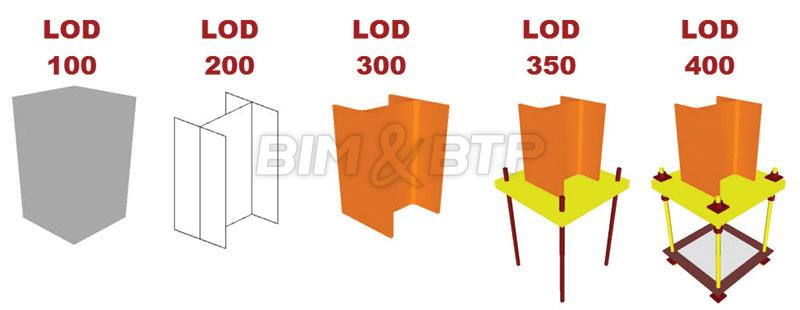
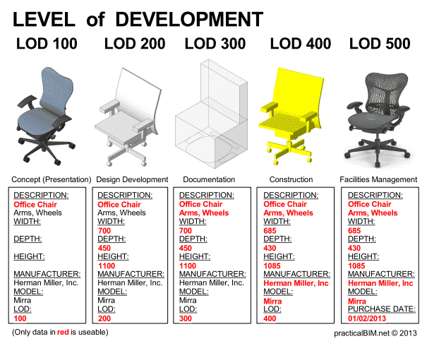

# Niveaux BIM

## Niveaux de collaboration

### Niveaux 0 et 1 : BIM `isolé`

Entre le niveau 0 et le niveau 1, il n'y a pas de réel changement de méthode de travail entre les différents acteurs.
Ce qui change, ce sont les supports d'échanges. 

* Dans le **niveau 0** (= pas de BIM), ce sont principalement des échanges de papiers électroniques (PDF).
* Au stade du **niveau 1** (= pratique courante), chacun réalise des maquettes numériques pour ses propres besoins, mais les maquettes ne sont pas échangées. Les échanges les plus courants sont issus des maquettes "personnelles", les plus souvent sous la forme de fichiers informatiques 2D.

Les échanges s'effectuent souvent par mail au format `.dwg`, il peut y avoir une plateforme commune de partage-échange de fichiers. Une collaboration nécessaire s'effectue entre les acteurs travaillant en 2D-3D (unités, points d'insertion, calques, ...). Cette collaboration est gérée au mieux dès le début au travers d'une charte, dictée par le client si c'est un acteur majeur (EDF, SNCF, ...), ou dictée par le collège de MOE si le projet est important (Grand Paris Express)

### Niveau 2 : BIM `collaboratif`

À partir de ce **niveau 2** (=début du BIM) de maturité, ce sont les méthodes de collaboration qui commencent à se transformer.

Chaque acteur peut créer sa maquette numérique en 3D contenant uniquement ses propres données. 
L'un des acteurs, souvent le BIM Manager, réunit les différentes maquettes de chaque acteur et vérifie l'absence de conflits.

Le BIM de niveau 2 est aujourd'hui le plus commun. Il est même imposé dans certains pays, comme au Royaume-Uni pour les marchés publics depuis 2016.

### Niveau 3 : BIM `intégré`

À ce stade **niveau 3** (= "full" BIM), il n'y a plus d'échanges de différents fichiers mais une vraie collaboration continue entre les intervenants. Les acteurs travaillent sur une **maquette numérique unique**, et ils peuvent le faire en même temps. On a donc un processus collaboratif en temps réel.

Ce niveau de collaboration demande de la part de tous les acteurs d'adopter une même méthode de travail rigoureuse.
Les accès et autorisations à une **plateforme commune** doivent être parfaitement gérés et planifiés.

La maquette « unique » est hébergée sur un serveur, en local, chez un hébergeur (OVH, etc.), ou dans le cloud pour plus de sécurité (cloud = réplication de multiples serveurs). Chaque corps de métier peut travailler en simultané et en temps réel. Aujourd'hui, certaines technologies permettent d'avoir une maquette « centrale » sur un serveur et des « sous-maquettes » par corps d'état. Ces sous-maquettes peuvent ensuite être synchronisées et venir enrichir la maquette centrale.

Ce niveau n'est que très rarement déployé, car même si certains aventuriers :muscle: :alien: tentent de s'y frotter. :metal:, cela reste "compliqué" à mettre en oeuvre ! :pirate_flag:

## Niveaux de détail

Le BIM ne remet pas en cause l’existence des phases de maturation d’un ouvrage. Aussi, au même titre que les plans 2D devenaient de plus en plus fournis et précis au cours des différentes étapes de la conception, la maquette va également suivre une évolution en « plusieurs passes » venant nourrir la maquette.

Le Niveau de détail de la maquette dépend de la phase du projet dans laquelle vous vous trouvez. Internationalement les différents niveaux de détails suivants (appelés **LOD** de l'anglais Level of Detail) ont été adoptés :

<!---
(https:--bimbtp.com-premium-les-niveaux-de-detail-dune-maquette-)
-->

En termes généraux :

* LOD 100 (idée) = il y a quelquechose
* LOD 200 (esquisse) = il y a quelquechose de cette taille
* LOD 300 (documentation) = il y a quelquechose de cette taille avec ces fonctions et options
* LOD 400 (réalisation) = c'est cette chose particulière 
* LOD 500 (exploitation/maintenance) = cette chose particulière a été construite par untel à cette date

Les niveaux de détail d'une maquette sont confondus avec les niveaux de développement d'un projet.
Cela rejoint le principe de la loi MOP pour les éléments de mission de MOE en phases : ESQ(DIA)-AVP(APS-APD)-PRO(PC)-ACT-EXE(VISA)-DET(OPC)-AOR

### LOD 100
Les éléments du modèle peuvent être représenté par un symbole ou de manière générique. Les informations contenues dans les éléments peuvent provenir d'autres éléments. 

_Par exemple,_ l’ouvrage n’est qu’un volume sommaire. **Ce niveau est comparable à l’esquisse**. Il permet déjà de réaliser des simulations d’encombrement et d’aménagement des locaux

### LOD 200
Les éléments du modèle sont représentés graphiquement d'une manière générique en tant qu'objet ou assemblage. Les dimensions, quantités, formes, positions et orientations des éléments peuvent être approximatives.

_Par exemple,_ le poteau devient un ouvrage ayant des caractéristiques mécaniques sommaires mais suffisantes pour réaliser des calculs d’efforts et de dimensionnement.

### LOD 300
Les éléments du modèle sont représentés graphiquement d'une manière spécifique en tant qu'objet ou assemblage. Les dimensions, quantités, formes, positions et orientations sont spécifiques aux éléments.

_Par exemple,_ le poteau est clairement identifié, il possède des dimensions précises et est associé à un modèle précis de profilés métalliques existants dans le commerce.

### LOD 350
Les éléments du modèle sont représentés graphiquement d'une manière spécifique en tant qu'objet ou assemblage. Les dimensions, quantités, formes, positions et orientations sont spécifiques aux éléments. Les éléments interagissent avec les autres éléments.

_Par exemple,_ les détails d’assemblage sont à l’étude, ils permettent déjà de consulter des entreprises et l’établissement de devis, mais se sont pas assez aboutis pour être utilisés en exécution.

### LOD 400
idem LOD 350 mais avec en plus les informations sur le détail, la fabrication, l'assemblage et l'installation sont contenues dans les éléments.

_Par exemple,_ le niveau de construction est suffisamment détaillé et documenté pour servir à lui seul de base au chantier pour réaliser les travaux.

### LOD 500
idem LOD 400 mais tel que construit et vérifié sur place, correspond à la maquette numérique DOE (Dossier des Ouvrages Exécutés), livrée au client et qui lui sert de base pour l’exploitation de son bâtiment en tant qu’« avatar réaliste ».

À noter que des informations non graphiques peuvent être attachés aux éléments à tous les niveaux.

### LOD d'un composant

Ici ce sont plus de **niveaux de détail** que des _niveaux de développement d'un projet_

Appliqués à un mobilier, ces niveaux de détails trouvent une définition assez semblable.

Ainsi pour cette chaise de bureau, les niveaux de détails seraient :

* LOD 100 (concept) = il y a une chaise
* LOD 200 (volumes) = il y a une chaise qui a un volume requis de 450x700x1100
* LOD 300 (documentation) = il y a une chaise de 450x700x1100 avec des accoudoirs et des roues
* LOD 400 (construction) = toutes les cotes, détails, assemblages permettant de réaliser cette chaise
* LOD 500 (exploitation/maintenance) = chaise de marque ..., modèle numéro ..., vendue par ..., achetée le ..., à remplacer le ..., résistance au feu ...

## Ressource supplémentaire
Une spécification complète (PDF de 400 p.(EN) + tableau Excel) est disponible au téléchargement :

* :fontawesome-solid-download:  [spécifications LODs :fontawesome-regular-file-pdf:][9]
* :fontawesome-solid-download:  [tableaux LODs :fontawesome-regular-file-excel:][10]

[9]: .-images-notions-3.12.20-LOD-Spec-2019-Part-I-and-Guide-2019-04-29-1.pdf
[10]: .-images-notions-LOD-Spec-2019-Part-II.xlsx